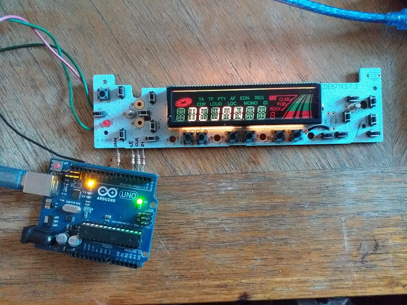
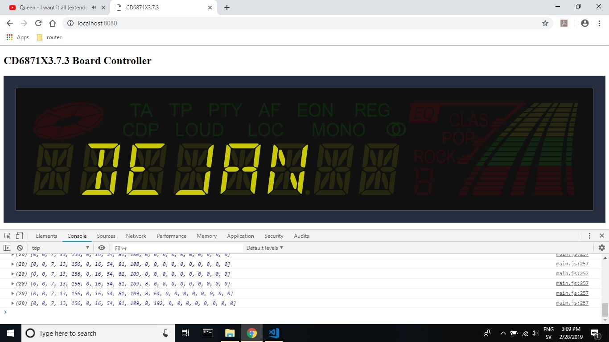
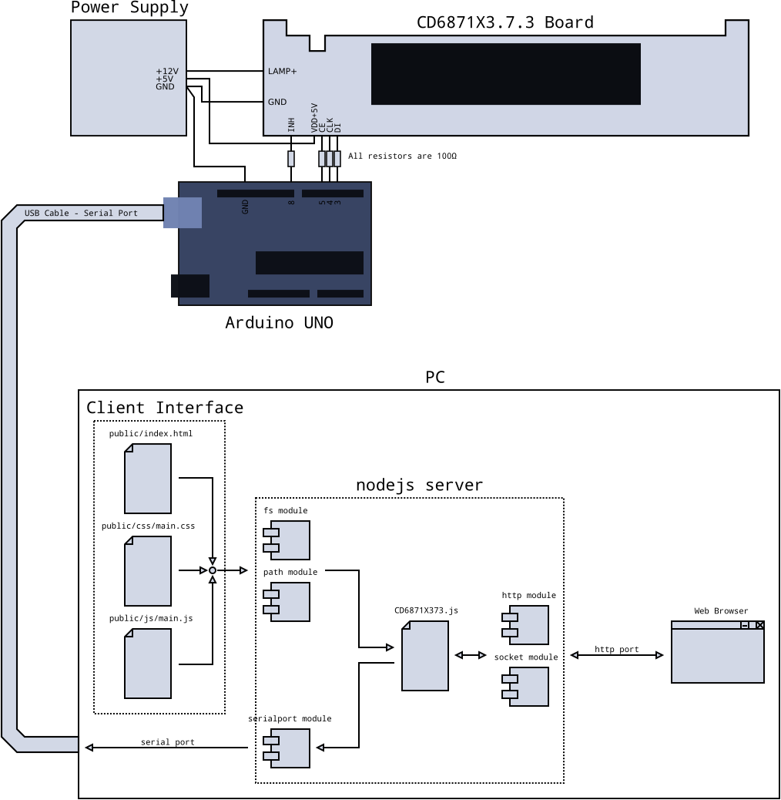

# CD6871X3.7.3 Board Controller
## Quick view
This is a Web Application which controls states of CD6871X3.7.3 board display segments, turning those on or off, by clicking on corresponding segment on SVG image in client interface page on Web Browser. It uses arduino to communicate between PC and device. On PC it uses nodejs to communicate between arduino and client interface (web browser).
## Design
  
*Picture of device*  
  
  
*Picture of Client Interface on Web Browser*  
  
  
*Graphical description of connections and functionallity of application*  
  
### CD6871X3.7.3 Board
This is front panel board from car radio. It have push buttons and 156 segment LCD display with background light, which is supplied separately with 12V. Background light draws approximately 400mA so it must be supplied from additional source (not from PC). I reccomend 12V/1A supply. The rest of board is supplied with 5V and draws current less than 100mA. Display have 8 14-segment characters for messages, have one one 7-segment character for number, some status segments, equalizer segments, etc... Display is controlled by `SC75823E` chip, which communicates with Arduino using CCB format communication, receiving data through three communication pins: `DI` - data, `CLK` - clock pulses, and `CE`, and turns display segments on or off, depending on received data. For more details about this communication format, look at datasheet for this chip:  
[http://www.picbasic.ru/_fr/13/SC75823e.pdf](http://www.picbasic.ru/_fr/13/SC75823e.pdf)  
Schematic for this device is in eagle folder:  
[CD6871X3.7.3.pdf](eagle/CD6871X3.7.3/CD6871X3.7.3.pdf)
### Arduino
Arduino receives data from PC through USB serial port. Simple Command Line Interface has been implemeted for this purpose. When Arduino receives data, it converts those for CCB format communication and sends those to target device. For more details, look at Communication section of this file. Arduino is supplied with 5V by PC. No need for additional supply.
### PC - Running Application
This application is designed and tested only on Windows 10 platform. To run ths application, you need to install Node.js. Executable script is `CD6871X373.js` and it's located in nodejs folder. To run this application, open Command Prompt, go to nodejs folder and type:  
`node CD6871X373.js`  
After that, open Web Browser and type:  
`localhost:8080`  
Client interface web page with SVG image of display, will appear. Now you have control over target device.
## Communication
### Web Browser - Node.js http server
Node.js http server sends client interface to Web Browser in three files: `index.html`, `main.css` and `main.js`. This communication is through port `8080`.  `Index.html` shows SVG image identical to look of LCD display on CD6871X3.7.3 board. Simply clicking on image segments, it changes style of segment, turning it on or off.  `Main.js` prepares data of current segment states. Those data are organized in data transfer array, an array of 20 numbers. Each number, except last one, holds state information of 8 segments. In example:  
`0 (dec) = 0x00 (hex) = 00000000 (binary, 8 bits, 8 segment states)`  
`255 (dec) = 0xff (hex) = 11111111 (binary)`  
`240 (dec) = 0xf0 (hex) = 11110000 (binary), etc...`  
Data transfer array:  
Example of all segments off:  
`[0, 0, 0, 0, 0, 0, 0, 0, 0, 0, 0, 0, 0, 0, 0, 0, 0, 0, 0, 0]`  
Example of all segments on:  
`[255, 255, 255, 255, 255, 255, 255, 255, 255, 255, 255, 255, 255, 255, 255, 255, 255, 255, 255, 240]`  
First number consists of `D1`(highest), `D2`, `D3`, `D4`, `D5`, `D6`, `D7` and `D8`(lowest) bits.  
Second number consists of `D9`, `D10`, `D11`, `D12`, `D13`, `D14`, `D15` and `D16`  
...  
20th number cosists of `D153`, `D154`, `D155`, `D156`, `DR`, `SC`, `BU` and `reserved`  
Bits from `D1` to `D156` are bits for display segments states (data bits). `DR`, `SC` and `BU` are control bits. For common use, they should be set to logical `0`, otherwise device will not turn segments on. More about it can be found in `SC75823E` datasheet:  
[http://www.picbasic.ru/_fr/13/SC75823e.pdf](http://www.picbasic.ru/_fr/13/SC75823e.pdf)  
State of `reserved` bit does not affect communication. Commonly it's logical `0`.
### Node.js - Arduino
Node.js executable script receives data transfer array through WebSocket and converts those in array of 20 characters. Values and order of bits remains unchanged. After that, Node.js sends command `d` to arduino, followed with chars from converted data transfer array in same order.  
Example of all segments off (data sequence):  
--- | --- | --- | --- | --- | --- | --- | --- | --- | --- | --- | --- | --- | --- | --- | --- | --- | --- | --- | --- | ---  
`d` | `\0` | `\0` | `\0` | `\0` | `\0` | `\0` | `\0` | `\0` | `\0` | `\0` | `\0` | `\0` | `\0` | `\0` | `\0` | `\0` | `\0` | `\0` | `\0` | `\0`  
--- | --- | --- | --- | --- | --- | --- | --- | --- | --- | --- | --- | --- | --- | --- | --- | --- | --- | --- | --- | ---  
Example of all segments on (data sequence):  
`d`|`\xff`|`\xff`|`\xff`|`\xff`|`\xff`|`\xff`|`\xff`|`\xff`|`\xff`|`\xff`|`\xff`|`\xff`|`\xff`|`\xff`|`\xff`|`\xff`|`\xff`|`\xff`|`\xff`|`\xff`  
-|-|-|-|-|-|-|-|-|-|-|-|-|-|-|-|-|-|-|-|-  
### Arduino - CD6871X3.7.3 Board
Arduino receives transfer data array through serial port, preceded with command 'd' and executes its function `serialTransferData` which implements serial data transfer protocol for LCD Driver chip `SC75823E`. This protocol consists of sending CCB address of 1 byte to device, which must be `0x41`, otherwise chip will not accept further data. After that, function translates data transfer array to binary format and sends it to device. All address and data bits are send through `DI` line, with clock pulses through `CLK` line. For every single data or address bit, one clock pulse is send. `CE` line is used to mark address bits. Arduino uses first version of serial data transfer format, when `CL` is stopped at the low level. For more details about this, see `SC75823E` datasheet:  
[http://www.picbasic.ru/_fr/13/SC75823e.pdf](http://www.picbasic.ru/_fr/13/SC75823e.pdf)
